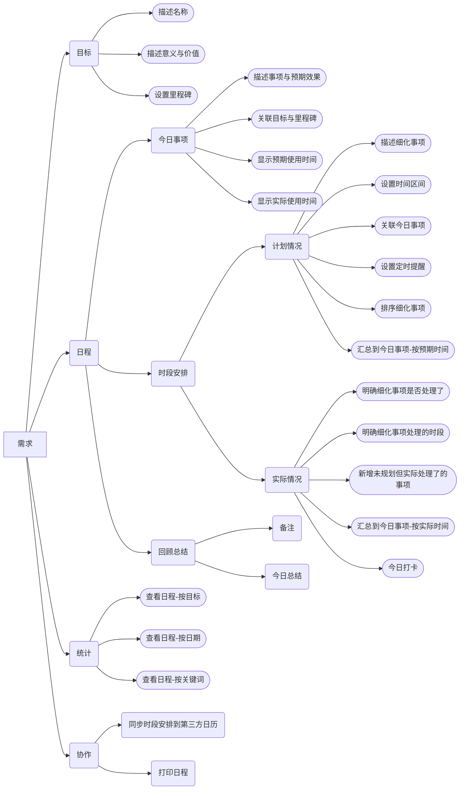
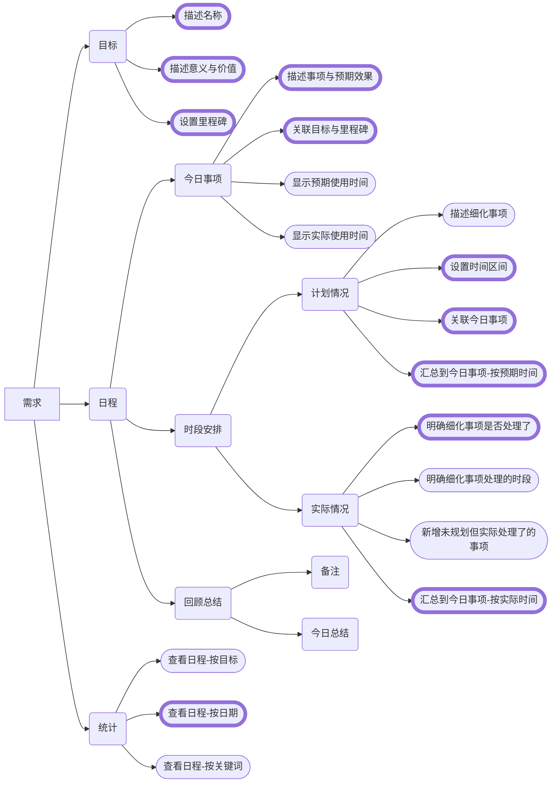

通过产品定位和切入点来判断需求的必要性与优先级。
<!--more-->

***
{: data-content='正文开始'}

* toc 
{:toc}

我们先来谈谈需求分析的常用方法，然后再用这些方法来确定`planned.today`的需求。
# 需求分析方法
## 需求分析的通用原则
在确定了目标用户和使用场景后，我们可以罗列出许多需求，这些需求既可能是创作者自行设想的，也可能是通过用户访谈收集到的，还可能来自于其他相关方。

这里的重点是要把需求收集和需求分析拆分为两个独立的阶段，而不是混在一起。

收集需求的时候，不要对需求做判断分析，而是要以数量为标准，收集的越多越好，渠道来源越广越好。在收集的同时我们还将需求进行有逻辑的组织，以方便记录与日后检索，形成一个可以全面了解需求情况的`需求池`。需求的组织方式有很多种，比如可以按用户使用产品的环节来分类，《幕后产品》[^1]提到，网易云音乐早期的需求池就是按这种方式来分类的。这样分类的好处能清晰地纵览产品所处领域的上下游。也可以按需求类型分类，比如分为体验改善型、功能增强型、长期布局型等，这种需求组织方式常用于版本迭代，有利于与产品团队的其他成员沟通协作。
{:width="500" loading="lazy"}{:.centered}
*图片来源：《幕后产品》*

进行需求分析时，有两个最容易犯的错误：
- 根据需求的反馈次数来判断需求的合理性与重要程度。
- 直接按需求原始描述来分析和设计功能。

实际上，对一个需求进行分析的第一步是搞清楚需求背后的**动机**是什么。即为什么对方会提出这个需求，他真正想解决的问题是什么，这个问题产生的原因是什么。有的时候我们会发现，几个不同的相关方看似提的是同一个需求，但背后的动机却是完全不同的。 只有搞清楚了一个需求的动机后，我们才真正的理解了这个需求。我们才能正确的判断需求的合理性与重要程度，才能够进行功能设计来真正满足需求。

搞清楚需求的动机后，我们需要进一步分析这个需求的合理性，对于相对简单的需求，我们往往可以直接得出结论。而对于有很多角色、有多个的使用场景、使用流程比较长的复杂需求，要想直接得出结论就不那么容易了。幸好，有一个强大的方法可以帮助我们来完成这一点，那就是`角色-场景-流程分析法`。这个方法从三个维度来拆解一个需求，会比直接看待需求更深入细致。这个方法的基本思路是：
- 角色：对同一个功能，分别考虑不同角色的诉求。
- 场景：分析需求真实发生的场景，考虑实际情况。
- 流程：分析满足需求的关键路径，判断能否满足。

在《幕后产品》一书中，以对AA收款需求进行详细分析的方式作为示例，用了整整一节来介绍这个方法，建议阅读。

即使确定了需求是合理的，也并不代表我们就要实现这个需求。是否需要实现一个需求，需要评估它的影响范围和带来的利弊。
在很多时候，每个需求的实现有有利有弊，是双刃剑；每个需求都可能与其他需求相关联，对其他需求产生影响，甚至牵一发动全身。只有需求对产品的长期目标有利，才是需要考虑实现的需求。

## 从整体把握需求
一个成熟的产品可以用上面介绍的通用需求分析方法来判断，但如果是从零开始的新产品，我们更需要的是从全局出发，整体性地把握需求。要想做到这一点，就需要首先明确`产品定位`，找准产品的`切入点`，只有明确了产品定位和切入点后，我们才能对新产品的需求做出正确的取舍判断。

产品定位用一句话来概括就是：基于明确的目标用户群体的重点需求，提供有别于其他竞品的**独特的**卖点与价值，从而获得市场竞争优势。

对于新产品来说，产品定位至关重要。因为它决定了：
- 产品能否在初始阶段存活下来。
- 产品今后发展的天花板有多高。

设计产品定位是一个非常复杂的过程，需要非常深入的思考。但无论如何，它有三个必要步骤：
- 分析行业、市场、竞争对手，从抽象到具体一步一步剖析产品所处的环境。
- 寻找产品切入点，找到产品打开市场的引爆点。
- 在切入点的基础上，对产品进行阶段性规划，设计产品架构。

很多人把产品定位理解为`差异化`，这个理解没有错，但不能为差异化而差异化。有意义的差异化要同时满足三个要素：用户需求重点、竞品薄弱环节、己方存在优势。

对于新产品来说，最难的是从零到一。而从零到一最难的地方在于找到合适的切入点。有两个关键词可以帮助我们开阔寻找切入点的思路：
- **细分**：探索更细分市场的情况和更细分用户的重点需求，从中发现机会。
- **新兴**：前瞻性的思考未来的变化趋势，从中发现机会。

# planned.today 的需求分析
了解了以上方法后，我们来具体看看`planned.today`应用的需求。下图中的需求采集自前文的用户故事和头脑风暴。
## planned.today 的需求池

从中我们可以看到，需求很多。每个需求单独来看，我们不太容易判断出需求的必要性与优先级。这时，我们就需要考虑产品定位，通过分析竞争对手和明确产品切入点来建立全局视角，进而才能进行需求分析。

## planned.today 的竞品分析
在`App Store`上用`目标管理`和`日程管理`作为关键词搜索，找到以下排名靠前的应用，进行功能对比。

| 对比项  | 官方三件套 | 滴答清单 | 指尖时光 | 小日常 |
| ------------- | ------------- | ------------- | ------------- | ------------- |
| 概述  | Notes Reminders Calendar |  待办事项、日程管理 | 日程管理 | 习惯养成 |
| 目标设定  | Notes 支持  | 支持项目计划、习惯  | 目标设定，可定时提醒 | 可设置习惯重复与执行时间段 |
| 日程  |  Calendar 支持  | 任务清单支持优先级、时段排序；番茄钟  | 日程清单，番茄钟 | 无日程概念，但可用习惯代替 |
| 日历视图  | Calendar支持  | 拖动管理任务，可订阅第三方日历  | 支持 | 打卡日历 |
| 定时提醒  | Reminders支持  | 支持  | 支持 | 支持 |
| 专注模式  |  无  | 支持  | 支持 | 无 |
| 数据统计  | 无  | 按习惯统计，按任务、清单、标签统计，支持天周月  | 目标达成度 | 按周、月查看 |
| 打卡分享  | 无  | 有  | 有 | 有 |
| 回顾总结  | 无  | 基本功能  | 无 | 无 |
| 集成协作  | iCloud  | 微信公众号  | 无 | 无 |
| 商业模式  | 系统自带  | 免费增值  | 免费增值 | 免费增值 |

*仅对比个人使用场景的功能，忽略了团队使用场景的相关功能。*

从对比表格可以看到，滴答清单的产品定位比较全面，同时涵盖了待办事项(Todo)，日程管理(GTD)和番茄钟等常见效率工具，还包含日历视图、数据统计，打卡等功能，提供的功能最多；指尖时光跟滴答清单的定位和功能都比较重合；小日常则专注于个人习惯养成，与前两者有一定的差异化。官方三件套作为系统自带的应用，每个应用的功能独立，需要配合起来才能满足主要使用场景，而且缺乏数据统计功能。

## planned.today 的切入点
从`planned.today`的用户故事来看，与滴答清单、指尖时光两个APP同属日程管理这个细分市场。因此如何对进行差异化定位就成了很关键的因素。

从用户需求的重点看，目标设定、日程管理和数据统计属于核心需求。

从竞品的薄弱环节看，目标与日程的关联不强， 回顾功能偏弱。同时完备的功能也同样意味着重点不突出，使用相对复杂。

最终确定`planned.today`的切入点是：让用户拥有像用笔在纸上随意规划日程一样的体验感受和纵览全局的视角。

具体来说，在功能上需要：
- 专注目标与日程，强化目标与日程的关联；
- 强化回顾总结功能；

确定了切入点后，我们就可以对需求池中的需求做取舍了。舍弃掉打卡分享相关需求、舍弃掉定时提醒需求，协作类需求优先级降低。
最终，我们得到了一个需求的优先级列表，粗边框代表高优先级需求。

# 引用参考
[^1]:[《幕后产品》](https://book.douban.com/subject/33396395/ "幕后产品")